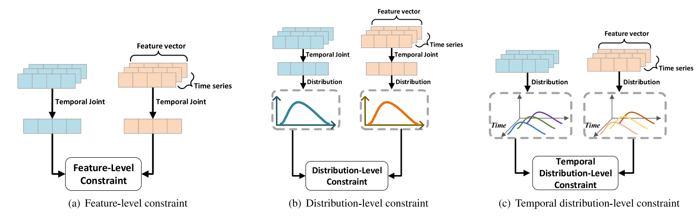
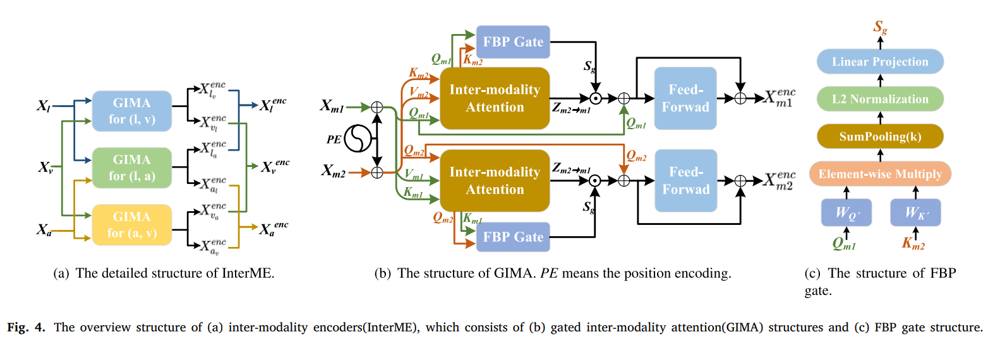
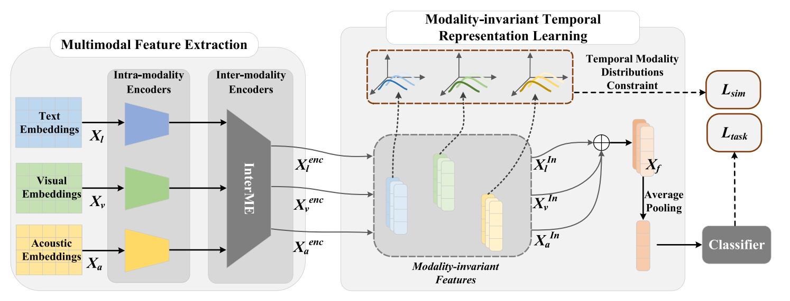

# MITRL
The codes for **Modality-invariant temporal representation learning for multimodal sentiment classification**, published in journal ***Information Fusion***

As shown in the figures, in this paper, we 
* propose a modality-invariant temporal representation learning strategy to refine unified sentimental information from multiple modalities. We treat each timestamp as a Gaussian distribution for relevant modality features and introduce KL divergence of multivariate to constrain their temporal distribution-level similarity. 

* design a Transformer-based parallel structure to effectively learn the comprehensive sentimental information. The parallel structure can uniformly perform inter-modality interactions.

* propose a gated inter-modality attention mechanism to adaptively perform inter-modality interactions and filter inconsistent subsequences between modalities. 



To run the codes, define the data_paths in Dataset/UnifiedDataset.py, then run:

```bash
python TrainSimilarityWithLoss.py
```


For convenience, we ultilize the datasets the datasets in **Context-aware Interactive Attention for Multi-modal Sentiment and Emotion Analysis** (https://github.com/GussailRaat/EMNLP-19-IIM). You can download the dataset from [here](https://drive.google.com/drive/folders/1IVgdjfRGSqnai45ksot7UZ5C-1xJBBWZ?usp=sharing) (the link is also from the above repository).


If you have ultilized the codes in this paper, please cite as follows:

```
@article{sun2023modality,
  title={Modality-invariant temporal representation learning for multimodal sentiment classification},
  author={Sun, Hao and Liu, Jiaqing and Chen, Yen-Wei and Lin, Lanfen},
  journal={Information Fusion},
  volume={91},
  pages={504--514},
  year={2023},
  publisher={Elsevier}
}
```
